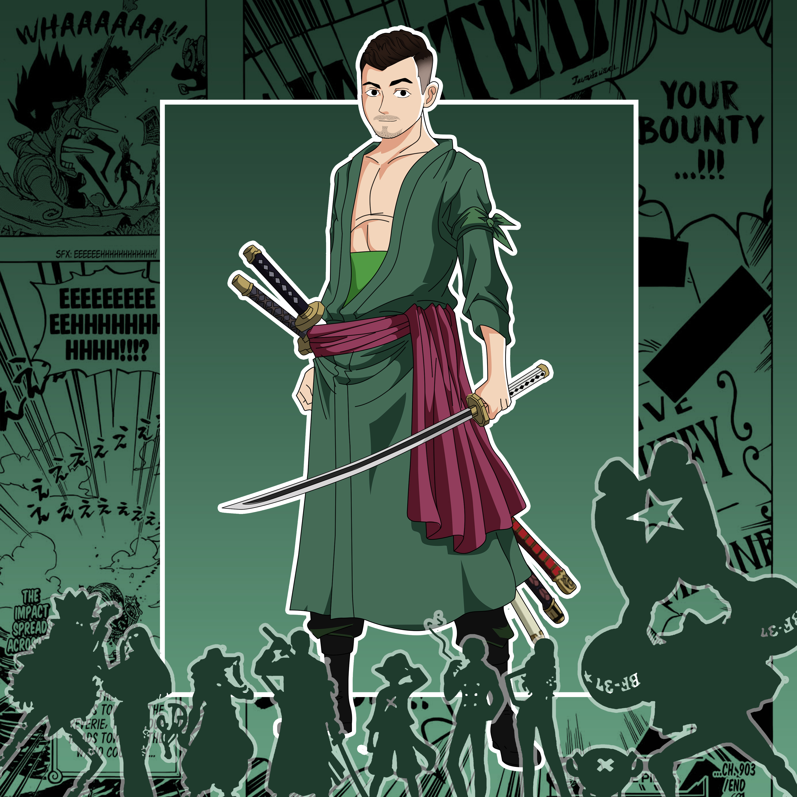
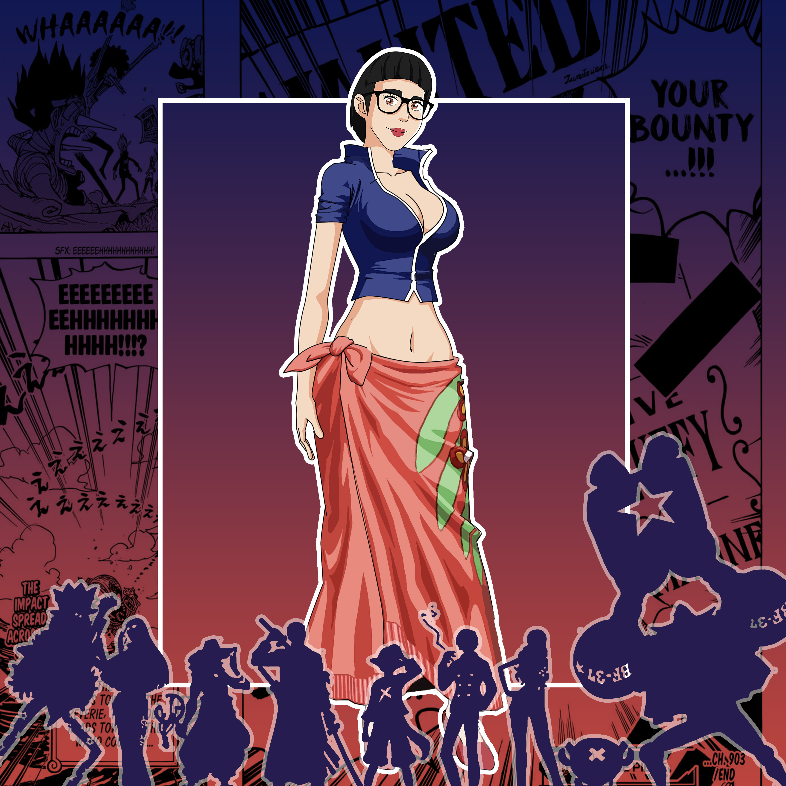

La ciurma di Sunny, che ha sede nella bellissima austrungarica Trieste - città del mare e del caffè - è così composta:

<Row>
<Col>

##### Kledi  
Training:  
Completed missions:  
Special attributes:  
Weapons:  

</Col>
<Col>

##### Stefano  
Training:  
Completed missions:  
Special attributes:  
Weapons:  

</Col>
<Col>

##### Daniele - Unicorno x Fiocco di neve 
###### Training:
Liceo Classico - Bachelor in Finance - Master in Business Economics - Corso in comunicazione - International Exchange (Graz) 
###### Completed missions:
Dal 2004 al 2006 lavori saltuari, nel 2009 Factoring per l'immobiliare, dal 2012 al 2017 TLC  
###### Special attributes:
Life enthisiast  
###### Weapons:
Se non lo so lo imparo 

</Col>
</Row>

<Row>
<Col>

##### Enrico  
Training:  
Completed missions:  
Special attributes:  
Weapons:  

</Col>
<Col>

##### Susanna  
Training:  
Completed missions:  
Special attributes:  
Weapons:  

</Col>
<Col>

##### Davide  
Training:  
Completed missions:  
Special attributes:  
Weapons:  

</Col>
<Col>

##### Denis  
Training:  
Completed missions:  
Special attributes:  
Weapons:  

</Col>
</Row>
