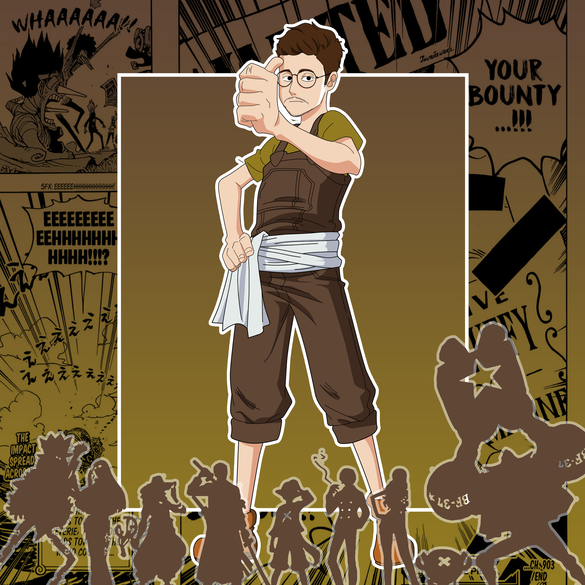

La ciurma di Sunny, che ha sede nella splendida austro-ungarica Trieste - porto di mare e città del caffè - è composta da persone eterogenee ma affiatate che danno vita ad una piccola comunità responsabile, entusiasta, resiliente e concreta:

<Row>
<Col>

##### Kledi  
##### CEO 
###### ENFP-A 
###### Il saggio 

###### Intro:  
Assertivo 
###### Forma mentis:  
PHD (Giurisprudenza), metodo prima di tutto 
###### L'epifania:  
La terapia 
###### La svolta:  
Dare le dimissioni 
###### @sunny:  
Esaltare le competenze di tutti 
###### 4sunny:  
Guanto di Thanos, abilità, sorprendenza, poliedricità, indipendenza e genio 
###### Finale:  
“Il lavoro non ci renderà liberi” 
 

</Col>
<Col>

##### Stefano  
##### Creative director 
###### INFP-A 
###### ? 

###### Intro:  
Creativo, idealista, appassionato, DJ 
###### Forma mentis:  
Autodidatta affamato 
###### L'epifania:  
Steve Jobs di Isaacson (18 anni) 
###### La svolta:  
La terapia 
###### @sunny:  
Dare vita ai brand 
###### 4sunny:  
Guanto di Thanos, abilità, sorprendenza, poliedricità, indipendenza e genio 
###### Finale:  
Lo studio è sopravvivenza 
 

</Col>
<Col>

#### Daniele 
##### Project manager 
###### ? 
###### ? 

###### Intro:  
Vedi Finale 
###### Forma mentis:  
De-forma mentis 
###### L'epifania:  
Non ho ancora raggiunto la consapevolezza 
###### La svolta:  
Vedi sopra 
###### @sunny:  
Tuttofare 
###### 4sunny:  
Guanto di Thanos, abilità, sorprendenza, poliedricità, indipendenza e genio 
###### Finale:  
Vedi Intro 
 

</Col>
</Row>

<Row>
<Col>

#### Enrico  
##### SMM, Content Creator 
###### ENFJ-T 
###### L'amante 

###### Intro:  
Empatico 
###### Forma mentis:  
Ho un approccio umanistico, quello che so l’ho imparato da colleghi e amici 
###### L'epifania:  
L'innamoramento 
###### La svolta:  
Diventare responsabile 
###### @sunny:  
Golden boy, stakanovista, un po' fortunello, un po' talentuoso 
###### 4sunny:  
Sicurezza, miracolante, magnetico, energia, dedizione e umiltà 
###### Finale:  
Ringrazio Sunny, per avermi formato per fare il lavoro che amo 
 

</Col>
<Col>

#### Susanna  
##### CFO 
###### ESFJ-T 
###### Angelo custode 

###### Intro:  
Creativa 
###### Forma mentis:  
Ho un approccio umanistico, quello che so l’ho imparato da colleghi e amici 
###### L'epifania:  
Maternità 
###### La svolta:  
Dimissioni 
###### @sunny:  
Tiro le somme 
###### 4sunny:  
Stabilità, sicurezza, professionalità, equilibrio, bussola 
###### Finale:  
Ringrazio Sunny, per avermi formato per fare il lavoro che amo 
    

</Col>
<Col>

#### Davide  
##### SEO Specialist 
###### ESFP-T 
###### Esploratore 

###### Intro:  
Audacemente sensibile 
###### Forma mentis:  
Data Driven, autodidatta, pratico 
###### L'epifania:  
Abbandono Laurea Magistrale 
###### La svolta:  
La volontà di far parte di 1000 Sunny 
###### @sunny:  
Esploratore 
###### 4sunny:  
Guanto di Thanos, abilità, sorprendenza, poliedricità, indipendenza e genio 
###### Finale:  
"Per essere felici occorre avere il coraggio di scegliere" 
   

</Col>
<Col>

#### Denis  
##### SMM, Content Creator 
###### ENTJ-T 
###### Sovrano 

###### Intro:  
Trendy 
###### Forma mentis:  
Logica, ordinata, organizzata 
###### L'epifania:  
La sveglia alle 4.40 
###### La svolta:  
L'aspettativa 
###### @sunny:  
Quello che serve fare 
###### 4sunny:  
Cane da pastore, intrigante, creativo, pragmatico, positivo e produttivo 
###### Finale:  
"Ho la forza dentro" 
       

</Col>
</Row>
